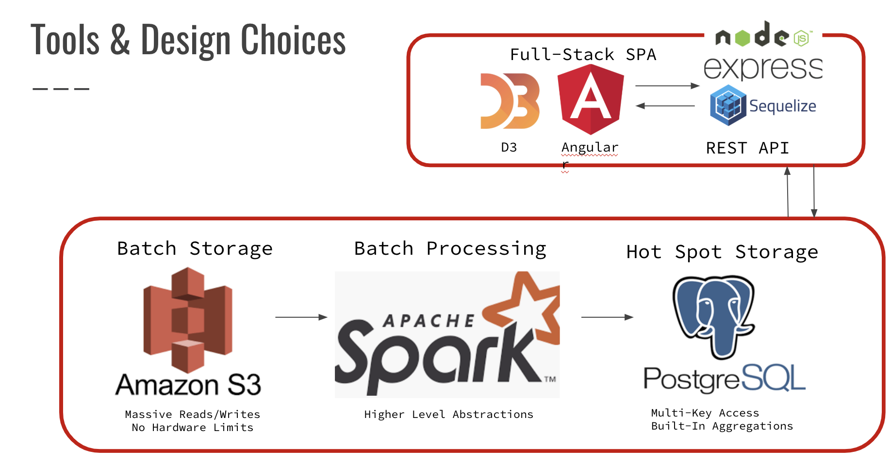

# WeeWaze: Traffic Visualization from SFMTA

## Introduction

The economic cost of traffic congestion exceeds $500 billion a year; having access to fine-grained historical traffic patterns is useful for running prediction algorithms. 

I worked on WeeWaze as a data engineering fellow at Insight Data Science. The purpose is to translate approximately 87GB of GPS logs from SFMTA into a format that can be used to dynamically generate historical traffic patterns in San Francisco given an arbitary time range.  I built a data pipeline that supports ad hoc queries, an SPA (single page application) that interacts with the user, and a REST API that interfaces with the entire dataset post transformation.  Take a look at the API inside [root/app_public](https://github.com/yezixbei/WeeWaze/tree/master/app_api).

## Dataset

The original dataset is 87GB of GPS logs spread over approximately 1200 CSV files.  It covers the routes of 330 buses in San Francisco over the span of four years from 2013 to 2016. It has the following schema: [REV, REPORT_TIME, VEHICLE_TAG, LONGITUDE, LATITUDE, SPEED, HEADING, TRAIN_ASSIGNMENT, PREDICTABLE], but the columns we are interested in are [REPORT_TIME, LONGITUDE, LATITUDE, SPEED, HEADING]. The size of the original dataset is about a billion rows.  See the dataset at [data.sfgov.org](https://data.sfgov.org/Transportation/Historical-raw-AVL-GPS-data/5fk7-ivit).

## Tools & Design Decisions

I used S3 for batch storage, Spark for batch processing, and PostgreSQL for adhoc storage. I built the REST API with Express, Sequelize, and Node.js and the single page application with D3 and Angular. Angular was chosen for the front end for its reusable components because of the short time constraints of the project, and D3 provides interactive data visualizations. 

## Pipelines

The end product shoud be a map over San Francisco for an arbitary time range. In the first pipeline (the first column in the diagram below), for each row in the form of [timestamp, gps, speed], I translated the timestamp into a time slot, divided San Francisco into squares of n meters, and translated gps coordinates into the location of its square. Next,  I did a groupby over these two parameters to get the sums and counts of speed. This transformation is performed in Spark and will shrink the original dataset from 1 billion to about 2 milion rows, resulting in the following schema [time slot, square location, speed sum, speed count]. The results are then stored in Postgres. 

In the second pipeline (the second column), for each square, I found the average speed using the speed sum and counts.  The input is small enough that the second computation can be done in Postgres at run time.  I can either query my API to dynamically generate a plot of the average speeds for a time range or use the UI. The UI queries my API at run time. The inputs are a day of the week, and a time range during a day in hours. 

## Engineering Challenge

One challenge for this project is making the pipeline scalable. Aside from picking the right tools, one main strategy is to use heuristics to keep transformations simple for the tools I picked.  In my case my bottleneck was translating complex transformations into simple ones so that it can be scaled in Spark. 

For example, how to do reverse coding coordinates per row for a large dataset? There are paid services like Google Roads that can be queried for a smaller dataset. What I ended up doing is dividing San Franciso into squares of size n (e.g. 100 meters) using the rule that the bounding box of a set of coordinates to the mth decimal place is n meters long. This means if I round the longitude and latitude of each row to the mth decimal place, every point within the same bounding square can be accounted for by using a group by.  Next I projected the edges of each square using something called equirectangular projection, which is a simple multiplication, to generate a visualization of the map in 2D. 

## Getting Started

### Environment Setup

Install and configure [AWS CLI](https://aws.amazon.com/cli/) and [Pegasus](https://github.com/InsightDataScience/pegasus) on your local machine, and clone this repository using `git clone https://github.com/yezixbei/WeeWaze.git.`  

Before creating a cluster, make a VPC with a single subnet with the AWS VPC Wizard and create a security group for this project.  Open all TCP communication between nodes in the same security group, and open ssh communication to your IP. Record your subnet-id and your security-group-id for Pegasus.

<h4>Deploying Your AWS Instances and Installing Spark
</h5>

Use Pegasus to quickly deploy your cluster.  First update your bash profile with your aws credentials.  Next update your yml files with your subnet-id and your security-group-id. The yml files are stored under /pegasus/examples/spark. One master and three slaves should be enough to run the batch job. Either type `run ./pegasus/examples/spark/spark_hadoop.sh"` in the appropriate folder or manually install hadoop and spark using Pegasus commands.

<h4>Installing PostgreSQL
  
</h4>

Install your PostgreSQL on your master node. To install, type `sudo apt install postgresql PostgreSQL-contrib`.  Login as superuser "postgres". Change your listen_address from "localhost" to "*" in postgresql.conf and change your permissions in pg_hba.conf.  Both files should be located in /etc/postgresql. Next start your postgresql service by typing `sudo service postgresql start`.

Type `wget "https://jdbc.postgresql.org/download/postgresql-42.2.8.jar` and save your jar file.

## Running WeeWaze

### Starting the Batch Job

On the master node of your cluster, type 

`/usr/local/spark/bin/spark-submit \
	--driver-memory 4G \
    --executor-memory 4G \
	--master spark://$<master node private ip>:7077 \
    --jars <path to your jar file> \
    batch_etl.py`

### Deploying your SPA

Initialize git by typing `git init` in your root folder and initialize heroku by typing `heroku create`.  Inside app_public type `ng build --prod --output-path build`, and in your root folder type `npm install`. This will install all your dependencies and compile all your typescript files into a giant javascript file.   Add and commit your changes via git, then deploy the SPA to heroku by typing `git push heroku master`.

## License

The MIT License (MIT)

Copyright (c) 2019 Yezi Bei

Permission is hereby granted, free of charge, to any person obtaining a copy of this software and associated documentation files (the "Software"), to deal in the Software without restriction, including without limitation the rights to use, copy, modify, merge, publish, distribute, sublicense, and/or sell copies of the Software, and to permit persons to whom the Software is furnished to do so, subject to the following conditions:

The above copyright notice and this permission notice shall be included in all copies or substantial portions of the Software.

THE SOFTWARE IS PROVIDED "AS IS", WITHOUT WARRANTY OF ANY KIND, EXPRESS OR IMPLIED, INCLUDING BUT NOT LIMITED TO THE WARRANTIES OF MERCHANTABILITY, FITNESS FOR A PARTICULAR PURPOSE AND NONINFRINGEMENT. IN NO EVENT SHALL THE AUTHORS OR COPYRIGHT HOLDERS BE LIABLE FOR ANY CLAIM, DAMAGES OR OTHER LIABILITY, WHETHER IN AN ACTION OF CONTRACT, TORT OR OTHERWISE, ARISING FROM, OUT OF OR IN CONNECTION WITH THE SOFTWARE OR THE USE OR OTHER DEALINGS IN THE SOFTWARE.
